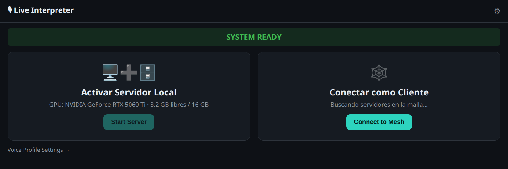

# Live Interpreter

> Speak one language. Your meeting hears another — in your own voice. All local.



Live Interpreter is a local-first, real-time voice interpreter. You speak; it
transcribes (Whisper), translates (Ollama), and synthesizes the translation back
**in your own cloned voice** (Qwen3-TTS), then feeds that voice into a PipeWire
virtual microphone (`live-interpreter-mic-source`) that any meeting, call, or
streaming app can select as its input. Everything runs on your machine — no
cloud, no per-minute fees.

Supported directions: **Spanish ↔ English** (`es_to_en`, `en_to_es`).

## How it works

```text
your mic ─▶ Whisper ASR ─▶ Ollama translate ─▶ Qwen3-TTS (your voice) ─▶ PipeWire virtual mic ─▶ meeting app
```

The translation is streamed clause-by-clause, so the first audio starts playing
before the whole sentence has been synthesized. A GPU is used when present; ASR
on CUDA is roughly 20× faster than CPU.

## Requirements

- **Linux** with PipeWire.
- **Rust** (edition 2024 toolchain).
- **NVIDIA GPU** recommended, ≥ 8 GB VRAM. CUDA is optional but strongly advised.
- **Ollama** running locally with a translation model published as `translator:latest`.
- A **Qwen3-TTS-compatible** service (bundled installer below).
- A **Whisper ggml model** (downloaded separately — not in the repo).

System build dependencies (Debian/Ubuntu):

```bash
sudo apt-get install -y build-essential cmake pkg-config clang libclang-dev \
  libasound2-dev libpipewire-0.3-dev libspa-0.2-dev
```

## Build

```bash
# Server + control panel (CPU)
cargo build --release

# All binaries, including native audio (virtual mic, local interpreter, mesh)
cargo build --release --features native-audio

# GPU build (Whisper on CUDA — ~20× faster ASR)
cargo build --release --features cuda,native-audio
# or: ./scripts/build-gpu.sh
```

## Models and services

```bash
# Whisper ASR model
./scripts/download-whisper-model.sh large-v3-turbo

# Qwen3-TTS voice service (installs, then serves on :8020)
./scripts/install-qwen3-tts-rs.sh
./scripts/start-qwen3-tts.sh

# Ollama translation model: serve your model as `translator:latest` on :11434
```

## Run

### Single machine — the simplest path

Speak Spanish; the virtual mic emits the English translation in your voice:

```bash
LI_WHISPER_MODEL=data/models/ggml-large-v3-turbo.bin \
  ./target/release/li-interpret
```

Then select **`live-interpreter-mic-source`** as the microphone in your meeting app.

### Control panel (web UI)

```bash
./target/release/li-control      # http://127.0.0.1:8799
```

Start/stop the server, watch GPU/VRAM and health, manage your voice profile, and
join the LAN mesh — all from the browser (screenshot above).

### Server API

```bash
LI_WHISPER_MODEL=data/models/ggml-large-v3-turbo.bin \
  ./target/release/live-interpreter      # http://127.0.0.1:8787
```

- `POST /v1/interpret/file` — multipart: `audio`, `direction`, `synthesize`
- `POST /v1/interpret/text` — JSON text-in / translation-out
- `GET  /v1/stream/meeting` — WebSocket, streamed `StreamEvent`s
- `GET  /health`

### LAN mesh — put the GPU on another box

One node owns the GPU; lighter nodes offload to it and the translated voice
travels back over libp2p (mDNS discovery, Gossipsub health, latency-aware
provider ranking, optional `LI_MESH_TOKEN` auth):

```bash
LI_ROLE=provider ./target/release/li-mesh   # GPU node
LI_ROLE=consumer ./target/release/li-mesh   # lightweight node
LI_ROLE=bench    ./target/release/li-mesh   # stage timings / TTFA / RTF
```

## Your voice (cloning)

Record a short reference once; its timbre is injected into every synthesis.

```text
data/voice/reference.wav   # ~10 s of you reading the reference text
data/voice/reference.txt   # the transcript of that recording
```

Set `LI_VOICE_REF` / `LI_VOICE_REF_TEXT`, or save the profile from the control
panel. Without a reference, a neutral voice is used.

## Binaries

| Binary             | What it does                                | Feature        |
| ------------------ | ------------------------------------------- | -------------- |
| `live-interpreter` | HTTP/WS server (ASR → translate → TTS)      | —              |
| `li-control`       | Control-panel web UI (`:8799`)              | —              |
| `li-interpret`     | Full local loop → virtual mic               | `native-audio` |
| `li-mesh`          | LAN mesh node (provider / consumer / bench) | `native-audio` |
| `li-voice-demo`    | Text → cloned voice → virtual mic           | `native-audio` |

## Configuration

Behavior is driven by `LI_*` environment variables. The full list lives in
[src/config.rs](src/config.rs); the most useful ones:

| Variable                | Default                  | Purpose                                       |
| ----------------------- | ------------------------ | --------------------------------------------- |
| `LI_BIND`               | `127.0.0.1:8787`         | Server bind address.                          |
| `LI_WHISPER_MODEL`      | —                        | Path to the whisper.cpp ggml model.           |
| `LI_OLLAMA_URL`         | `http://127.0.0.1:11434` | Ollama endpoint.                              |
| `LI_OLLAMA_MODEL`       | `translator:latest`      | Translation model.                            |
| `LI_QWEN_TTS_URL`       | `http://127.0.0.1:8020`  | Qwen3-TTS service.                            |
| `LI_MIN_SERVER_VRAM_MB` | `8000`                   | Minimum VRAM to enable server mode.           |
| `LI_VOICE_REF[_TEXT]`   | —                        | Reference voice WAV and its transcript.       |
| `LI_CONTROL_BIND`       | `127.0.0.1:8799`         | Control-panel bind address.                   |
| `LI_ROLE`               | `consumer`               | Mesh role: `provider` / `consumer` / `bench`. |
| `LI_MESH_TOKEN`         | —                        | Optional shared secret for mesh peers.        |
| `LI_AUTH_TOKEN`         | —                        | Optional bearer / `?token=` for the API.      |

## Develop

```bash
cargo fmt --all
cargo clippy --all-targets --features native-audio -- -D warnings
cargo test --lib
cargo build --release --features native-audio
```

CI ([.github/workflows/ci.yml](.github/workflows/ci.yml)) runs all of the above
on every push and pull request. Pushing a `vX.Y.Z` tag triggers
[release.yml](.github/workflows/release.yml), which builds the binaries and
publishes a versioned `x86_64-linux` tarball (with SHA-256) as a GitHub Release.

## Documentation

- [docs/meeting-client.md](docs/meeting-client.md) — client runtime and VAD tuning.
- [docs/qwen3-tts-contract.md](docs/qwen3-tts-contract.md) — TTS HTTP contract.
- [docs/rust-native-inference.md](docs/rust-native-inference.md) — native inference notes.
- [docs/architecture-refactor-fsm.md](docs/architecture-refactor-fsm.md) — architecture and roadmap.
